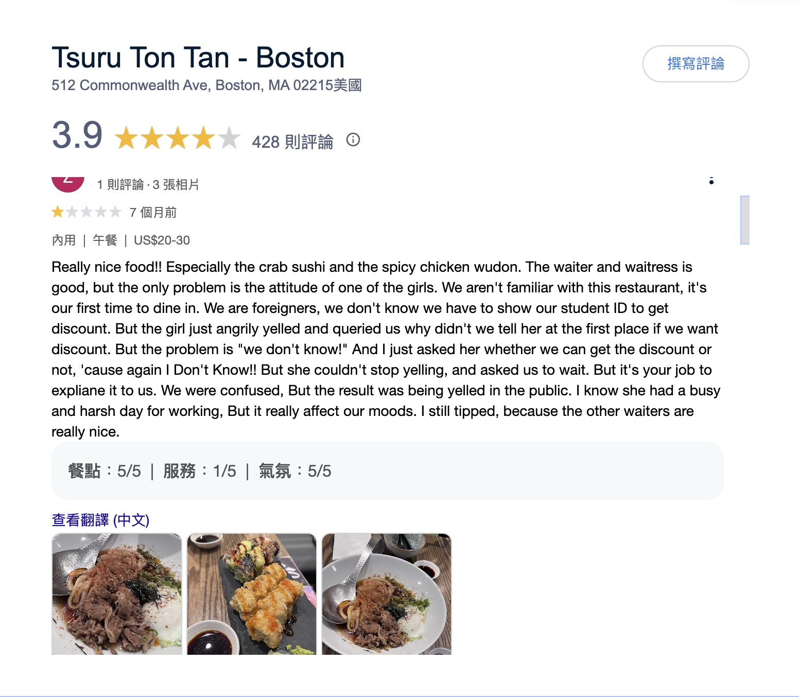
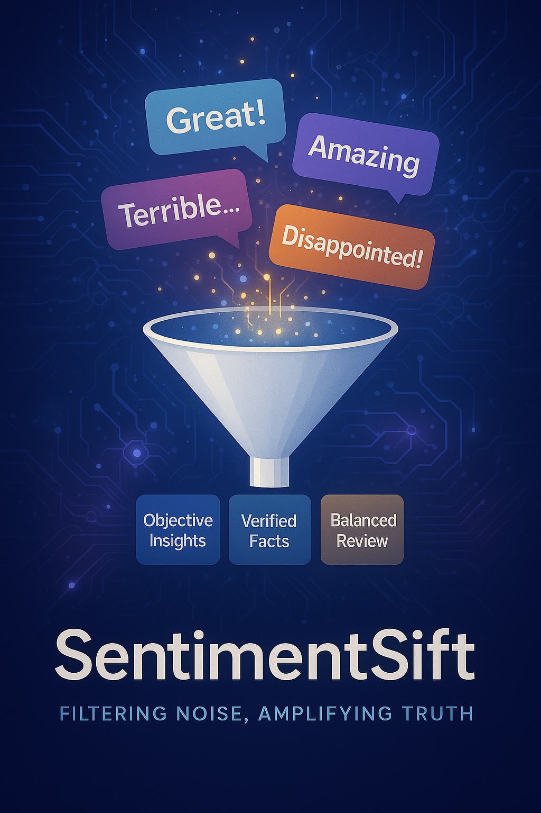
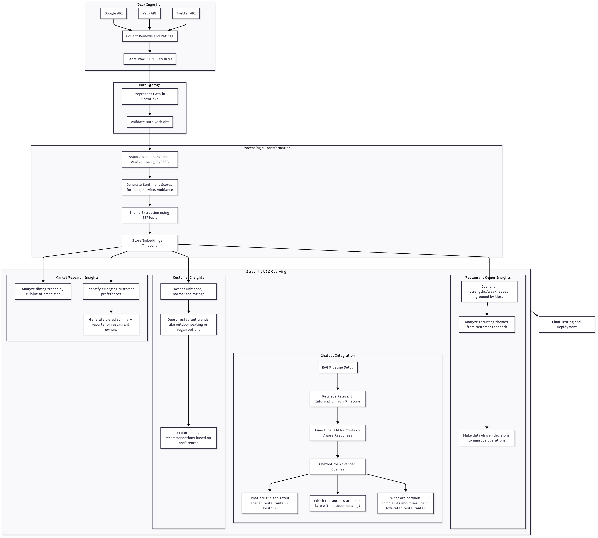

# SentimentSift: AI-Powered Review Analysis Platform

*Filtering Noise, Amplifying Truth.*

---

## Overview

**SentimentSift** is an AI-powered platform designed to filter emotional biases from online reviews and provide objective, fact-based insights for consumers and businesses. The platform also curates a network of reliable food bloggers, displaying all restaurants they've reviewed for trustworthy recommendations.

> 
> 

---

## Introduction

### Background

In the competitive restaurant industry, customer reviews and social media feedback shape perceptions and influence dining decisions. However, the lack of a unified system to normalize ratings and extract actionable insights from unstructured data creates challenges for restaurant owners, customers, and market researchers. Reviews often reflect biases and lack consolidated evaluations of key aspects such as food, service, and ambiance.

### Objective

Deliver actionable insights to stakeholders through:
- **Restaurant Owners:** Brief reports summarizing trends in high-performing restaurants.
- **Customers:** Consolidated, unbiased ratings for informed dining decisions.

---

## Project Overview

### Project Architecture

SentimentSift is designed as a modular, AI-powered platform for extracting objective insights from online restaurant reviews. The architecture features:

- **Data Ingestion:** Collects structured and unstructured data from APIs (Google, Yelp, Twitter) using Rapid API.
- **Preprocessing:** Cleans, normalizes, and enriches data with metadata.
- **Storage:** Raw data in JSON; processed data in Snowflake.
- **Analysis:**
  - *Aspect-Based Sentiment Analysis* (PyABSA) for food, service, ambiance.
  - *Theme Extraction* (BERTopic) for recurring topics.
- **Vector Embedding:** Stores embeddings in Pinecone for semantic search.
- **UI & Interaction:** Streamlit for visualization and querying.
- **Conversational AI:** RAG-powered chatbot (Gemini 2.0 flash) for natural language queries and context-aware responses.
- **SQL Agent:** Vanna.AI for advanced querying.

---

### Services Utilized

- **Rapid API:** Review and metadata aggregation.
- **Snowflake:** Data validation and storage.
- **PyABSA:** Aspect-based sentiment scoring.
- **BERTopic:** Topic modeling.
- **Pinecone:** Vector database for embeddings.
- **Streamlit:** Interactive web interface.
- **Gemini 2.0 flash:** RAG chatbot integration.
- **Vanna.AI:** RAG-powered SQL agent.

---

### Challenges Encountered & Solutions

| Challenge                          | Description                                                                                      | Solution/Workaround                                                                                   |
|-------------------------------------|--------------------------------------------------------------------------------------------------|-------------------------------------------------------------------------------------------------------|
| **Limited Data Access**             | Free, high-quality review data was scarce, limiting analysis reliability.                        | Prioritized data cleaning, flagged low-data restaurants, and planned for future dataset expansion.    |
| **Data Quality & Normalization**    | Reviews from different sources had inconsistent scales and formats.                              | Implemented robust preprocessing and normalization routines; flagged ambiguous or sparse data[5][6].   |
| **Sentiment Complexity**            | Mixed sentiments, sarcasm, and cultural nuances complicated analysis.                            | Used aspect-based models and topic extraction to isolate and clarify sentiment[4][5][6].              |
| **Multi-Agent Architecture**        | Coordinating multiple LLM agents for bias reduction increased system complexity.                  | Iteratively refined agent prompts and workflows for better collaboration and aggregation.              |
| **Integration Overhead**            | Combining multiple services and tools led to technical challenges.                               | Modularized the pipeline and used standard APIs for smoother integration and troubleshooting.          |

---

### Overcoming Challenges

- **Data Limitations:** Focused on maximizing value from available data, clearly flagging cases with insufficient information, and designing the system for easy scaling as more data becomes available[5].
- **Normalization:** Developed custom scripts to standardize ratings and sentiment scores, ensuring comparability across sources[5][6].
- **Sentiment Nuance:** Leveraged advanced NLP models capable of aspect-level analysis and topic modeling to address mixed sentiments and contextual subtleties[4][5][6].
- **System Integration:** Adopted a modular approach, allowing independent development and testing of each component before full pipeline integration.

---

### Development Insights

The project highlighted the importance of robust data collection, preprocessing, and the need for domain-specific models to handle the nuances of sentiment analysis. By iteratively refining both the technical pipeline and analytical models, SentimentSift was able to deliver actionable, unbiased insights despite initial data and integration hurdles.

---

## Stakeholders

- **Restaurant Owners:** Actionable reports on strengths/weaknesses.
- **Market Researchers:** Analytics for emerging dining trends.
- **Customers:** Unbiased, normalized ratings for decision-making.

---

## Problem Statement

### Current Challenges

- Managing unstructured review data across multiple platforms with inconsistent rating scales.
- Limited tools for extracting meaningful insights from customer feedback.
- Difficulty identifying trends in high- vs. low-rated restaurants.

### Opportunities

- Improved decision-making could boost customer retention.
- Enhanced analytics for real-time alerts on recurring issues.

### Use Cases

- Consolidated ratings for Boston restaurants based on sentiment scores.
- Tiered summary reports for high-performing restaurants.
- Interactive querying of trends via Streamlit UI.
- Chatbot queries such as:
  - "Top-rated Italian restaurants in Boston?"
  - "Restaurants open late with outdoor seating?"
  - "Common complaints about service in low-rated restaurants?"

---

## Resources and Team

- **Data Engineer:** API integration, data collection/preprocessing, Snowflake setup.
- **Machine Learning Engineer:** Sentiment analysis (PyABSA), theme extraction (BERTopic), RAG pipeline, chatbot.
- **Frontend Developer:** Streamlit UI, chatbot integration.

---

## Risks

### Risks

- API rate limits may delay data collection.
- Sparse review data may impact insight accuracy.
- Integration challenges between multiple technologies/tools.

---

### Expected Benefits

- Actionable insights for restaurant owners by tier.
- Unbiased, normalized ratings for customers.
- Trend identification for market researchers.
- Reduction in time to analyze customer feedback.

---

## Conclusion

SentimentSift integrates advanced tools (PyABSA, BERTopic, Pinecone, LangChain, OpenAI GPT-4, Snowflake, Streamlit) to bridge the gap between unstructured feedback and actionable insights—revolutionizing decision-making for the restaurant industry with its RAG-powered chatbot.

---

